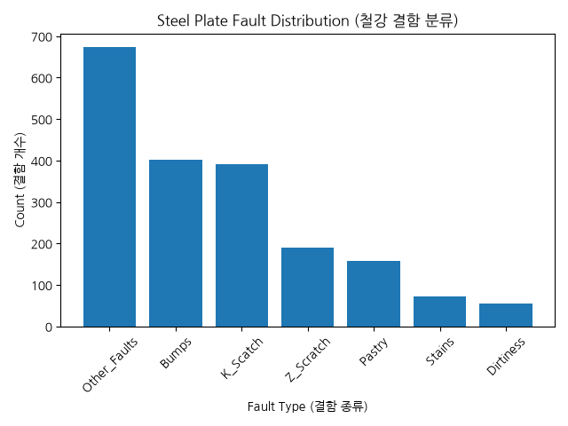

# ⚙️ Steel Plate Fault Analysis

## 01. 프로젝트 소개
- 이 프로젝트는 2026년 9월 10일에 시작한 데이터 분석 프로젝트로 UCI(미국 캘리포니아 어바인 대학) 머신러닝 리포지토리에서 제작된 철판의 결함 데이터가 담긴 파일인 `Faults.NNA`를 가지고 분류된 결함들을 분석하고 여러가지 시각화 자료를 생성해서 이를 보여주기 위한 목적으로 진행

국내 최대의 철강 대기업인 POSCO에서 후원하는 K-뉴딜 아카데미 딥러닝 1기 교육 과정에서 배운 파이썬(Python) 언어를 주로 사용했으며 분석 데이터 소재도 이런 배경 속에서 선정

## 02. 프로젝트 목적
- 철강 결함 데이터를 활용해 결함 유형별 발생 빈도, 면적·밝기·철판 두께·형태 특성을 분석하고, 
Pandas 기반 전처리와 교차분석 및 Matplotlib/Seaborn 시각화를 통해 결함 유형별 특징을 도출한 데이터 분석

## 03. 사용 데이터
- Faults.NNA (철판 결함 데이터)
- Faults27x7_var (철판 데이터의 열)

## 04. 개발 환경 / 사용 라이브러리
- Python (주요 언어)
  - pandas
  - numpy
  - matplotlib
    - pyplot
    - font_manager
  - seaborn
  - openpyxl

## 05. 데이터 전처리
- `isna()`를 이용하여 결측치를 확인한 결과, 결측치가 존재하지 않음을 확인
- `duplicated()`를 이용하여 중복 데이터를 확인한 결과, 중복 행이 존재하지 않음을 확인
- 7개의 결함 여부 열을 확인하여 각 데이터가 하나의 결함 유형을 갖는 것을 검증
- 기존 7개의 결함 여부 열을 이용하여 분석 편의를 위한 `fault_type` 파생변수 생성
- `Steel_Plate_Thickness`를 데이터 분포에 따라 Thin(얇은) / Medium(중간) / Thick (두꺼운) 으로
자체적으로 두께 구분을 하여 `Thickness_Group` 파생변수 생성

## 06. 데이터 분석

### 06-01. 결함 유형별 발생 현황
- 7개 결함 유형의 발생 건수 및 비율 분석
- Bar Plot을 이용한 결함 유형별 발생 빈도 시각화

### 06-02. 결함 면적 분석
- `Pixels_Areas`를 이용하여 결함 유형별 면적의 평균 및 분포 분석
- `groupby()`, `describe()`를 이용한 기초 통계 분석
- Box Plot을 통한 중앙값, 분포 및 이상값 확인

### 06-03. 밝기 분석
- `Sum_of_Luminosity`를 이용한 결함 유형별 밝기 특성 분석 
(결함 영역에 포함된 픽셀들의 밝기값을 모두 더한 값)
- Bar Plot / Box Plot을 통한 결함 유형별 비교

### 06-04. 변수 간 상관관계
- 숫자형 변수의 상관계수 계산
- Seaborn Heatmap을 이용한 전체 변수 간 상관관계 시각화
- `Pixels_Areas`와 `Sum_of_Luminosity` 사이에서 높은 양의 상관관계 확인

### 06-05. 주요 변수 Scatter Plot
- `Pixels_Areas`와 `Sum_of_Luminosity`의 관계 시각화
- 결함 유형별 색상을 구분하여 분포 비교
- 결함 유형별 상관계수 추가 확인

### 06-06. 상관관계가 높은 X/Y 좌표 변수 분석
- `X_Minimum ↔ X_Maximum`, `Y_Minimum ↔ Y_Maximum`의 높은 상관관계 확인
- 최소/최대 좌표의 차이를 계산하여 결함의 가로-세로 범위 확인
- 최대 차이를 갖는 데이터의 실제 행을 추적하여 이상값 분석

### 06-07. 철판 두께와 결함 유형 분석
- `Steel_Plate_Thickness`의 기초 통계 및 실제 값 분포 확인
- `pd.cut()`을 이용하여 Thin / Medium / Thick 그룹 분류 및 생성
- `pd.crosstab()`을 이용하여 두께 그룹과 결함 유형 교차분석
- 그룹별 표본 수 차이를 고려하기 위해 결함 구성 비율 계산
- 100% Stacked Bar Chart 및 Grouped Bar Chart를 이용하여 결과 시각화

### 06-08. 결함 밝기 특성 심화 분석
- Sum_of_Luminosity
  → 결함 영역과 관련된 luminosity 합계 변수
- Luminosity_Index
  → 결함의 luminosity와 관련된 연속형 지표
    (UCI에서 상세 계산식은 제공하지 않음)
- 두 데이터 영역은 모두 luminosity와 관련된 지표이지만 상관계수는 약 -0.01로 나타나, 
  두 변수 사이의 선형관계가 거의 나타나지 않음을 Scatter Plot을 통해 추가로 확인

### 06-09. 결함 형태 및 방향 특성 분석
- `Edges_Index`, `Edges_X_Index`, `Edges_Y_Index`, `Orientation_Index`의 전체 분포 확인
- `groupby()`를 이용하여 결함 유형별 형태/방향 변수의 평균 비교
- `Orientation_Index`의 Bar Plot / Box Plot을 이용하여 결함 유형별 분포 차이 확인
- `Edges_Y_Index`의 Bar Plot / Box Plot을 이용하여 결함 유형별 분포 차이 확인
- UCI 원본에서 일부 지표의 구체적인 물리적 의미가 명시되지 않은 점을 고려하여,
  값의 방향을 임의로 해석하지 않고 결함 유형별 상대적인 차이와 분포를 중심으로 분석

## 07. 주요 분석 결과

- 전체 1,941건 중 Other_Faults가 673건(34.67%)으로 가장 높은 비율을 차지했으며,
  Bumps 402건(20.71%), K_Scatch 391건(20.14%) 순으로 나타났다.

- `Pixels_Areas`와 `Sum_of_Luminosity`의 전체 상관계수는 약 0.98로,
  두 변수 사이에서 매우 강한 양의 상관관계가 확인되었다.

- K_Scatch의 평균 철판 두께는 `약 40.18`로 다른 주요 결함 유형보다 낮게 나타났다.

- 분석을 위해 철판 두께를 `Thin / Medium / Thick`으로 구분한 결과,
  Thin 그룹에서는 K_Scatch가 `42.76%`로 가장 높은 구성 비율을 보였다.

- `Steel_Plate_Thickness`의 실제 값 분포를 확인한 결과, 
  전체 1941개 중 710개(`약 36.6% 비율`)로 두께 40인 데이터가 가장 많았으며
  전체 최소값과 25% 기준값 역시 동일한 두께 40으로 나타났다.

- K_Scatch의 구성 비율은 `Thin 42.76%, Medium 0.13%, Thick 0%`로 나타나
  본 데이터에서 얇은 두께 그룹에 집중되는 패턴이 관찰되었다.

- Other_Faults는 `Thin 24.78%, Medium 34.53%, Thick 67.38%`로 나타나
  두께 그룹별 결함 구성에 뚜렷한 차이가 존재함을 확인하였다.

- Z_Scratch는 `Thin 0.88%, Medium 22.93%, Thick 3.58%`로
  Medium 그룹에서 상대적으로 높은 구성 비율을 보였다.

- `Luminosity_Index`의 결함 유형별 평균을 비교한 결과,
  Stains는 약 -0.01로 0에 가장 가까운 평균을 보였으며,
  Pastry와 Z_Scratch는 약 -0.19로 상대적으로 낮은 평균을 보였다.

- K_Scatch와 Other_Faults의 `Luminosity_Index` 표준편차는 각각 약 0.172, 0.167로,
  다른 일부 결함 유형에 비해 상대적으로 넓은 값의 분포를 보였다.

- `Sum_of_Luminosity`와 `Luminosity_Index`의 상관계수는 약 -0.01로 나타나,
  두 변수가 이름상 luminosity와 관련되어 있지만 선형적인 관계는 거의 나타나지 않았다.

- `Orientation_Index`의 평균은 K_Scatch와 Stains에서 음수로 나타난 반면,
  Pastry와 Dirtiness에서는 상대적으로 높은 양수 평균을 보여
  결함 유형에 따라 지표의 분포 차이가 관찰되었다.

- `Edges_Y_Index`는 여러 결함 유형에서 높은 평균을 보였으나,
  K_Scatch는 `약 0.527`로 다른 주요 결함 유형과 비교하여 상대적으로 낮게 나타났다.

## 08. 최종 인사이트

- 철판 결함 유형은 단순히 발생 빈도에서만 차이를 보이는 것이 아니라,
  결함 면적, 철판 두께, 밝기 관련 지표, 형태 및 방향 관련 변수에서도
  서로 다른 데이터 특성이 관찰되었다.

- 특히 철판 두께를 Thin / Medium / Thick으로 구분하여 분석한 결과,
  K_Scatch는 Thin 그룹에 집중된 반면 Other_Faults는 Thick 그룹에서 높은 구성 비율을 보여
  본 데이터에서 철판 두께 그룹과 결함 유형의 구성 사이에 뚜렷한 차이가 나타났다.

- `Pixels_Areas`와 `Sum_of_Luminosity`는 약 0.98의 높은 양의 상관관계를 보여,
  결함 영역의 크기와 밝기 총합이 밀접하게 함께 변화하는 특성을 확인하였다.

- 반면 `Sum_of_Luminosity`와 `Luminosity_Index`의 상관계수는 약 -0.01로 나타나,
  이름상 모두 luminosity와 관련된 변수이더라도 동일한 특성을 나타내는 지표로
  간주해서는 안 된다는 점을 확인하였다.

- 따라서 철판 결함 데이터를 분석할 때는 특정 변수 하나만으로 결함 특성을 판단하기보다,
  발생 빈도, 면적, 두께, 밝기 및 형태 관련 변수를 함께 비교하는 다각적인 분석이 필요하다고 판단하였다.

## 09. 향후 개선 방향
- 프로젝트 초반에는 데이터 로딩, 분석, 시각화, Excel 출력 코드가 하나의 파일에 구성되어
  프로젝트 규모가 커질수록 코드 관리와 분리 작업에 어려움이 있었다.
  향후 프로젝트에서는 초기 단계부터 기능별로 파일을 분리하여 코드 구조를 설계하고자 한다.

- 반복되는 Bar Plot과 Box Plot 코드를 초반에는 각각 작성하여 코드의 중복이 많아지고
  작업 시간이 길어지는 문제가 있었다.
  향후에는 반복되는 작업을 함수화하여 코드의 재사용성과 유지보수성을 높이고자 한다.

- 철판 두께를 Thin / Medium / Thick으로 구분하는 기준은 데이터 분포를 참고하여
  분석 편의를 위해 자체적으로 설정하였다.
  향후에는 분위수 기반 구간 분류 등 다른 기준과 비교하여
  구간 설정에 따른 분석 결과의 차이를 확인하고자 한다.

- 현재 프로젝트는 기술통계와 시각화를 이용한 탐색적 데이터 분석을 중심으로 진행하였다.
  향후에는 이번 분석에서 확인한 주요 변수들을 활용하여
  결함 유형을 예측하는 머신러닝 분류 분석으로 확장해보고자 한다.

## * 프로젝트 구조도
python_self_project_01/
│
├── base/
│   └── 01_data_loading.py
├── data/
│   └── Faults.NNA
│   └── Faults27x7_var
├── fonts/
│   └── NanumGothic-Regular.ttf
├── images/
│   └── 분석 그래프 이미지들
├── reports/
│   └── Steel_Plate_Fault_Analysis.xlsx
│
├── src/
│   ├── data_loading.py
│   ├── analysis.py
│   ├── visualization.py
│   └── excel_report.py
│
├── app.py
└── README.md